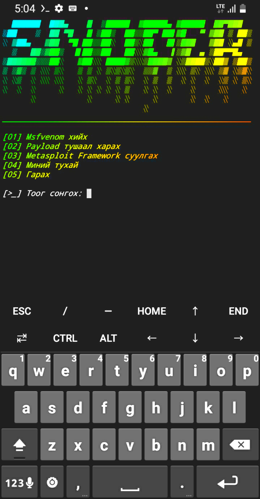

<h1> >_ Termux Exploitation Tool Snoder </h1>

<h1> Суулгах </h1>

<li> termux-setup-storage </li>

<li> cd $HOME </li>

<li> pkg update </li>

<li> pkg upgrade -y </li>

<li> pkg install git -y </li>

<li> git clone https://github.com/m0cy3rsy/snoder.git </li>

<li> cd snoder </li>

<li> chmod +x install.sh </li>

<li> ./install.sh </li>

<li> эсвэл </li>

<li> bash install.sh </li>

<li> дараан нь ./snoder </li>

